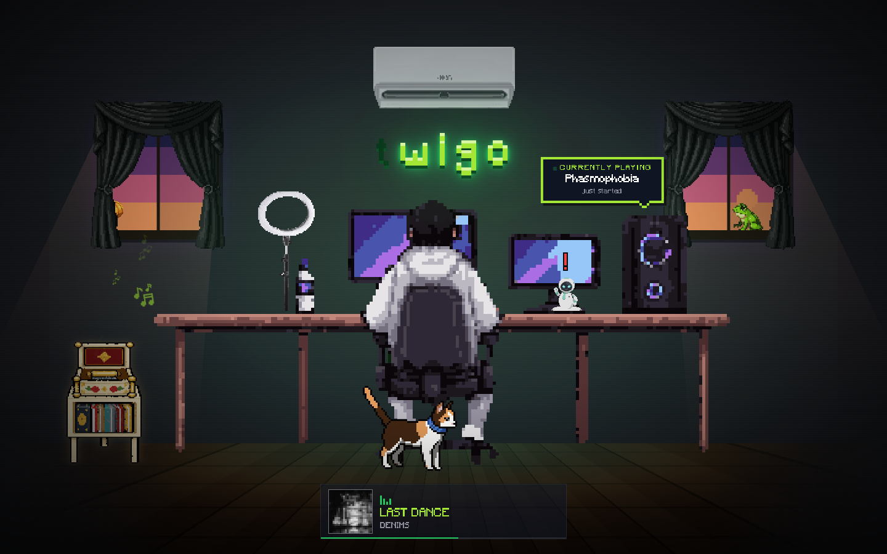
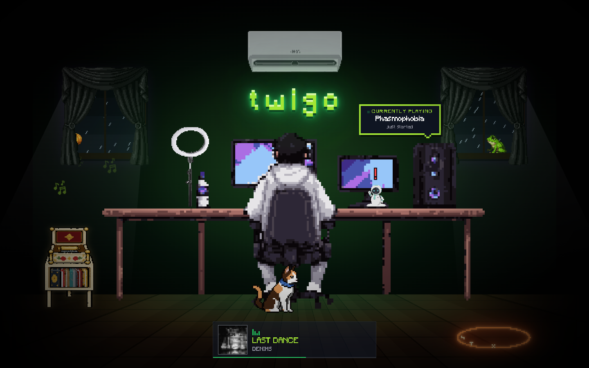

<div align="center">

# 🎮 twigo

### a pixel-art room that lives on its own

**[tw1go.github.io](https://tw1go.github.io)**



*No scrolling. No nav. One room, one guy at a desk — and a lot going on if you wait.*


</div>

---

## ✨ What's in the room

| | |
|---|---|
| 🧑‍💻 **twigo** | Games at his desk, fidgets, drinks water, talks to himself. |
| 🎮 **Live from Discord** | When twigo is really playing something, a *Currently playing* tag hangs over the PC — and he reacts, with lines for every game he plays. |
| 🎵 **Live from Spotify** | The strip at the bottom is what he's actually listening to. Notes float off the jukebox while it plays. |
| 🌦️ **Real weather** | The windows show *your* time of day and *your* weather: sunrise, sunset, moon and stars, rain, fog, storms with lightning. |
| 🪟 **Curtains** | Click the windows. The room only gets as much light as the sky outside has. |
| 🤖 **Elli** | The desk bot. Click her for gossip. |
| 🐈 **Lulu** | The cat, and the actual owner of the desk. Wanders, naps, jumps up, keeps watch. |
| 📼 **The jukebox** | Click it for the artists twigo listens to. |

<details>
<summary><b>🥚 Easter eggs</b> — spoilers! try finding them first</summary>

<br>

Every one of them is someone real. Every one of them has something to say.

| | who | where | what you get |
|---|---|---|---|
| 🎃 | **Biiko Kalabasa** | behind a curtain | a curse — petty, specific, permanent |
| 🧚 | **Fairy Cha** | rarely flies by (7.16%) | a blessing, and hearts over twigo |
| 🐀 | **Wonwuu** the Wandering Rat | sneaking along the floor | a trade, always in his favour |
| 🔱 | **Jord's Fork** | a ritual circle on the floor | a prophecy, from the night shift |
| 🦎 | **Dr. Pittuki** | on the wall, hiding | a therapy session, with matcha |
| 🐸 | **Croakyangs** | you'll *hear* him first | a serenade |

Also: Lulu hates Wonwuu. Pittuki hates Wonwuu. Wonwuu is friends with Jord.

</details>



---

## 🕹️ Console cheats

Open devtools on the live site:

```js
summonFairyCha()                  // she's shy — this skips the 7.16%
summonWonwuu({ from: 'left' })
summonJordsFork()
summonPittuki()

setTime('dusk')                   // dawn · morning · afternoon · dusk · night, or an hour 0–23
setWeather('storm')               // clear · cloudy · rain · storm · fog
setSky({ period: 'night', weather: 'rain' })
resetSky()                        // back to your real clock and forecast

setGame('Valorant')               // pretend twigo is playing something
setGame(null)                     // ...or nothing
setGame()                         // back to the real Discord presence
```

---

## 🛠️ Run it

Node **≥ 22.12** (Vite 8's bundler needs it — below that npm silently skips
its native binary). `.nvmrc` pins the version.

```bash
nvm use
npm install
npm run dev      # http://localhost:5173
npm run build    # tsc -b && vite build
npm run lint     # oxlint
```

Push to `master` and `.github/workflows/deploy.yml` publishes to GitHub Pages.

---

## 🧱 How it's built

**It's all one sprite frame.** The character's 256×256 art is the room's
coordinate system: every layer — wall, furniture, animals, dialog — is a box
the same size, so things are placed by *which pixel of the art* they sit on,
not by the viewport.

**Pixels stay square.** The room is drawn at the largest *whole-number* scale
that fits your screen both ways. Never 2.5×. Sprites that were drawn finer than
the room get redrawn onto its grid by `scripts/downsample-sheet.mjs` rather
than shrunk and blurred.

**One element per sprite.** Sheets are animated with a single registered
`@property` integer and CSS `steps()` — the frame index becomes a
`background-position` with `mod()` and `round()`. Adding a sheet is one entry
in `src/sprites/manifest.ts`.

**Nothing rotates.** Pixel art can't be rotated without breaking it, so the
lizard turns by mirror flips and the fork hovers instead of spinning.

**Live data, no secrets in the browser.**

| | source | how |
|---|---|---|
| 🎵 Spotify | a Vercel function | holds the refresh token; the site only ever sees title, artist, art |
| 🎮 Discord | [Lanyard](https://github.com/Phineas/lanyard) | a free WebSocket that republishes presence |
| 🌦️ Weather | [Open-Meteo](https://open-meteo.com) | free, keyless; your city comes from your timezone — no location prompt |

```
src/
├── App.tsx                  the room: layers, state, what reveals when
├── sprites/manifest.ts      every sprite sheet, sliced and timed
├── hooks/                   the character's brain · the scale that fits
└── features/
    ├── dialog/lines.ts      every word anyone in the room says
    ├── sky/                 time, weather, rain, lightning
    ├── discord/             "currently playing"
    ├── spotify/             "now playing"
    └── …                    one folder per resident
```

<details>
<summary><b>🎵 Setting up Spotify "now playing"</b></summary>

<br>

A static site can't do this alone: Spotify's refresh token never expires, so
shipping it in the bundle would hand permanent access to anyone with
devtools. One small function holds the credentials and returns only
title, artist, art and progress.

```
tw1go.github.io  ──fetch──▶  <project>.vercel.app/api/now-playing  ──▶  Spotify
   (static)                    (holds the secrets)
```

`api/now-playing.ts` is a Web-standard `Request → Response` handler, so the
same code serves Vercel and the local dev middleware in `vite.config.ts`.

1. **Register an app** at <https://developer.spotify.com/dashboard> with the
   redirect URI `http://127.0.0.1:8888/callback`.
2. **Copy `.env.example` to `.env.local`** and fill in the client ID and secret.
3. **Mint a refresh token:** `npm run spotify:auth`, then paste the printed
   `SPOTIFY_REFRESH_TOKEN` into `.env.local`. `npm run dev` now serves real data.
4. **Deploy the function to Vercel** with `SPOTIFY_CLIENT_ID`,
   `SPOTIFY_CLIENT_SECRET` and `SPOTIFY_REFRESH_TOKEN` as environment variables.
5. **Point the site at it.** `.env.production` holds
   `VITE_NOW_PLAYING_URL=https://twigo-portfolio.vercel.app/api/now-playing`
   (public — it's baked into the bundle anyway). A repository variable of the
   same name overrides it.
6. **Turn on Pages:** Settings → Pages → Source = *GitHub Actions*.

Only `user-read-currently-playing` is requested. It polls every 15s (never in
a hidden tab), counts paused as not playing, edge-caches for 10s, and fails
quietly to "Nothing playing" without ever saying why. CORS is limited to
`tw1go.github.io` and local dev.

</details>

<div align="center">

<br>

*made pixel by pixel* 🟪🟩

</div>
